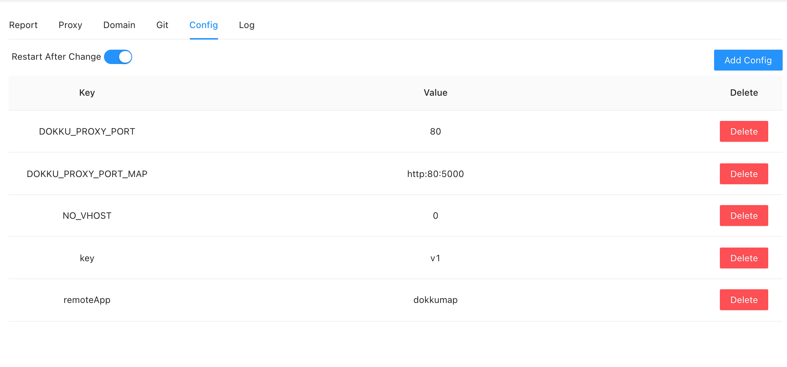
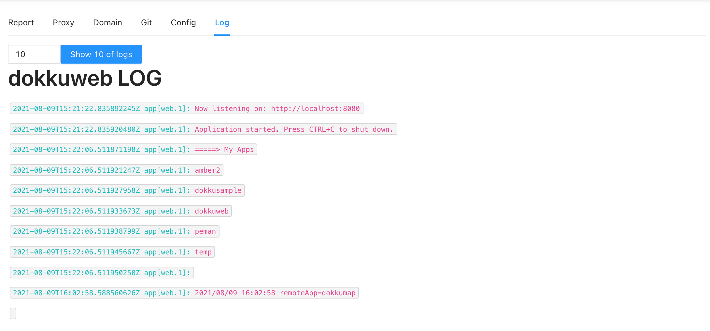
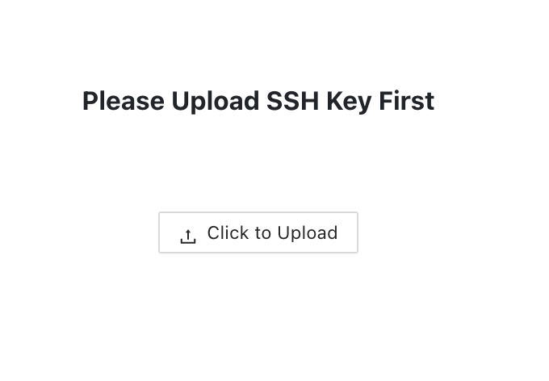

# Readme

## Web UI for Dokku

- What is [Dokku](https://dokku.com/) ?
- Front-end: React-js, [Here](https://github.com/skynocover/dokkuWebUI_FrontEnd)
- Back-end: Golang




## How to use

### clone this repository

```
git clone https://github.com/skynocover/dokkuWebUI.git
```

### Set environment variables

- .env

```env
SERVER_LISTEN=8080   # listen-port
VERSION=1.0.0        # version variable, only use on api: /api/version
ENV=development      # env variable, only use on api: /api/version

ACCOUNT="user"       # the only one user account
PASSWORD="123456"    # the only one user password

SSH_USER="dokku"     # dokku ssh user name
SSH_SERVER="1.1.1.1" # dokku server location 
```

- or docker enviroment

```docker
ENV SERVER_LISTEN=8080 
ENV VERSION=1.0.0
ENV ENV=development

ENV ACCOUNT="user"
ENV PASSWORD="123456"   

ENV SSH_USER="dokku"     
ENV SSH_SERVER="1.1.1.1"
```

- if you run dokkuweb in dokku, you could use config

```
dokku config:set dokkuweb SERVER_LISTEN=8080 [...]
```

### Run the docker local or push to your dokku server

> run in local

```
docker build -t dokkuweb .
```

```
docker run -p 8080:8080 dokkuweb
```

> push to remote dokku server, (don't forget to create app in dokku server)

```
git push dokku@dokku:dokkuweb
```

### If you first time to deploy, upload your ssh key



## Support

- If you want to design front-end by yourself, [here](https://github.com/skynocover/dokkuWebUI_FrontEnd) is the repository

